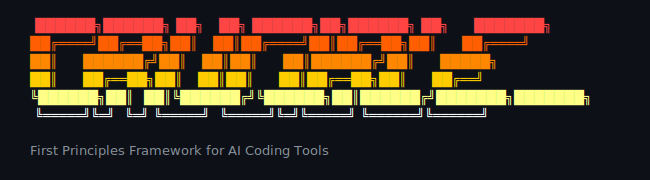

**Structured reasoning for AI coding tools** — make better decisions, remember why you made them.

**Supports:** Claude Code, Cursor, Gemini CLI, Codex CLI

> **Works exceptionally well with Claude Code!**

## The Problem This Solves

You're deep in a codebase. You need to handle cross-service transactions in a system that's grown beyond the point where distributed transactions are viable. Event choreography? Saga pattern? Outbox with CDC? Each has non-obvious failure modes.

Or: you're adding real-time features to an existing app. WebSockets vs SSE vs polling? The "obvious" answer depends on your infrastructure, scale trajectory, and failure tolerance — none of which fit neatly into a Stack Overflow answer.

Your AI tool gives you *an* answer. It's coherent. But:

- **Why** this approach? (You won't remember the reasoning in 3 months)
- **What alternatives** were considered? (Were there alternatives, or did you anchor on the first idea?)
- **What evidence** supported it? (Documentation? Benchmarks? Or just pattern-matching from training data?)
- **When does this decision expire?** (The tradeoffs shift as the system evolves)

FPF gives you a structured way to think through these decisions with your AI tool as a reasoning partner — not a black-box oracle. You generate hypotheses, verify them, test them, and document *why* you chose what you chose.

## Quick Start

### One-liner Install

##### Global install (recommended for personal use)
```bash
curl -fsSL https://raw.githubusercontent.com/m0n0x41d/crucible-code/main/install.sh | bash -s -- -g
```

##### Per-project install (run from project root)
```bash
curl -fsSL https://raw.githubusercontent.com/m0n0x41d/crucible-code/main/install.sh | bash
```

This launches an interactive installer where you select which AI coding tools to install FPF commands for (Claude Code, Cursor, Gemini CLI, Codex CLI).

> **Tip:** Cursor can import `.claude/commands/` directly — install for Claude Code, use in both! In Cursor: Settings → Rules and Commands. The toggle will be right there!

**Global** installs to `~/.claude/commands/` etc. — available in all projects.
**Per-project** installs to `./.claude/commands/` — commit to repo for team use.

### Manual Install

```bash
git clone https://github.com/m0n0x41d/crucible-code.git
cd crucible-code
./install.sh                    # Interactive TUI
./install.sh --claude -g        # Install Claude Code globally
./install.sh --all              # Install all platforms
```

### Initialize in Your Project

```bash
cd /path/to/your/project
# Then in your AI coding tool:
/fpf-0-init  # Creates .fpf/ structure and scans your repo

# Start reasoning
/fpf-1-hypothesize "How should we handle state synchronization across browser tabs?"
```

Follow the prompts. The AI guides you through the cycle. You make the calls.

## What Is This, Really?

A set of slash commands for AI coding tools that implement **hypothesis-driven reasoning**. You generate competing ideas, verify them logically, test them empirically, and document the rationale.

Based on the [First Principles Framework (FPF)](https://github.com/ailev/FPF) by Anatoly Levenchuk.

**The core loop:**

1. Generate multiple hypotheses
2. Verify them logically
3. Test them empirically
4. Audit for blind spots
5. Decide with full rationale documented

AI generates. You decide.

### Before/After

| Without FPF | With FPF |
|-------------|----------|
| "Let's use the Saga pattern" (first idea that came up) | 3 approaches analyzed with evidence, tradeoffs documented |
| "Why did we build it this way?" (3 months later) | Check `DRR-001.md` — full rationale preserved |
| "Is this assumption still valid?" | Run `/fpf-decay` — evidence freshness tracked |
| Same architectural debates, different meetings | Query knowledge base — past decisions searchable |

## The ADI Cycle

The ADI cycle is **strictly sequential** — each phase builds on the output of the previous one. You cannot skip ahead or reorder phases 1-3.

```
Problem Statement
       │
       ▼
┌──────────────────────────────────────────────┐
│  1. ABDUCTION (Hypothesize)                  │
│  Generate 3-5 competing hypotheses           │
│  Output: L0/ (unverified ideas)              │
└──────────────────────┬───────────────────────┘
                       ▼ (REQUIRED)
┌──────────────────────────────────────────────┐
│  2. DEDUCTION (Check)                        │
│  Verify logical consistency                  │
│  Output: L1/ (logically sound)               │
└──────────────────────┬───────────────────────┘
                       │ (REQUIRED)
          ┌────────────┴────────────┐
          ▼                         ▼
   ┌─────────────┐          ┌─────────────┐
   │  3a. TEST   │          │ 3b. RESEARCH│
   │  Internal   │          │  External   │
   │  evidence   │          │  evidence   │
   └──────┬──────┘          └──────┬──────┘
          └────────────┬───────────┘
                       │
                       ▼ (OPTIONAL - but recommended)
┌──────────────────────────────────────────────┐
│  4. AUDIT                                    │
│  WLNK analysis, bias check, adversarial view │
└──────────────────────┬───────────────────────┘
                       │
                       ▼
┌──────────────────────────────────────────────┐
│  5. DECIDE                                   │
│  Create DRR, archive session                 │
│  Output: L2/ (verified), decisions/DRR      │
└──────────────────────────────────────────────┘
```

### Phase Strictness

**Phases 1 → 2 → 3: Strictly sequential.** You cannot run `/fpf-2-check` without hypotheses from phase 1. You cannot gather evidence (phase 3) without logically verified hypotheses from phase 2. The commands enforce this — they will error if prerequisites aren't met.

**Phase 4 (Audit): Optional, but recommended.** You can skip directly from phase 3 to `/fpf-5-decide`. This produces a valid Design Rationale Record (DRR). However, skipping audit is generally not recommended — the WLNK analysis and bias check typically take only a few minutes and often catch blind spots that would otherwise ship with your decision.

**When skipping audit is acceptable:**

- Time-critical decisions where you've already done thorough evidence gathering
- Simple decisions with clear evidence and no competing hypotheses remaining
- You've committed to the ADI cycle and want to complete it — better to finish with a DRR than abandon mid-cycle

**When you should NOT skip audit:**

- Multiple hypotheses survived to phase 3 with similar evidence strength
- Evidence came primarily from external sources (congruence assessment needed)
- The decision affects multiple teams or has long-term architectural impact

## Commands Reference

### Core Cycle

| Command | Phase | What It Does | Required |
|---------|-------|--------------|----------|
| `/fpf-0-init` | Setup | Create `.fpf/` structure | Yes |
| `/fpf-1-hypothesize` | Abduction | Generate competing hypotheses → `L0/` | Yes |
| `/fpf-2-check` | Deduction | Verify logical consistency → `L1/` | Yes |
| `/fpf-3-test` | Induction | Run internal tests, benchmarks | Yes* |
| `/fpf-3-research` | Induction | Gather external evidence (web, docs) | Yes* |
| `/fpf-4-audit` | Audit | WLNK analysis, bias check | No** |
| `/fpf-5-decide` | Decision | Create DRR, finalize | Yes |

*At least one of `/fpf-3-test` or `/fpf-3-research` required before proceeding.
**Optional but recommended — see [Phase Strictness](#phase-strictness) above.

### Utilities

| Command | Purpose |
|---------|---------|
| `/fpf-status` | Show current phase and next steps |
| `/fpf-query <topic>` | Search knowledge base |
| `/fpf-decay` | Check evidence freshness |
| `/fpf-discard` | Abandon cycle, preserve learnings |

## Key Concepts

### Assurance Levels

| Level | Name | Meaning | How to Reach |
|-------|------|---------|--------------|
| **L0** | Observation | Unverified hypothesis | `/fpf-1-hypothesize` |
| **L1** | Reasoned | Passed logical check | `/fpf-2-check` |
| **L2** | Verified | Empirically tested | `/fpf-3-test` or `/fpf-3-research` |
| **Invalid** | Disproved | Was wrong — kept for learning | Failed at any stage |

### Formality (F-Score)

Rigor of expression (not truth, but precision).

- **F0-F2 (Sketch):** Rough ideas, whiteboard notes, vague constraints.
- **F3-F5 (Structured):** Steps, clear constraints, executable code/tests.
- **F6-F9 (Rigorous):** Formal proofs, math models, machine-checked invariants.

Most engineering work targets **F3-F5**.

### WLNK (Weakest Link)

**Critical rule:** Assurance = min(evidence), NEVER average.

```
Evidence A: L2 (internal benchmark)     → R_eff = 1.0
Evidence B: L2 (official docs)          → R_eff = 1.0
Evidence C: L1 (blog, low congruence)   → R_eff = 0.65

Combined Assurance: R_eff = 0.65 (capped by weakest)
```

One weak piece of evidence caps your entire argument. If you want solid decisions, you need to strengthen — or acknowledge — your weakest link.

### NQD (Novelty, Quality, Diversity)

We track three metrics to ensure we aren't just guessing:

- **Novelty:** How new is this idea? (Conservative vs. Radical). We want a mix.
- **Quality:** How likely is it to work? (High complexity = Higher risk).
- **Diversity:** Are we exploring different *types* of solutions? (e.g. Architectural vs. Operational).

### Method vs. Work

Crucible Code strictly separates the **Plan** from the **Result**.

- **Method (Design-Time):** The recipe. The code you plan to write. The "How-To".
- **Work (Run-Time):** The cooking. The test results. The logs. The "What Happened".

Hypotheses now define the **Method** (Plan) first, then outline the **Validation** (Work) needed to prove it.

### Congruence (for External Evidence)

External evidence may not apply to your context. Assess congruence:

| Level | Φ Penalty | Example |
|-------|-----------|---------|
| **High** | 0.00 | Same tech, similar scale, similar use case |
| **Medium** | 0.15 | Same tech, different scale |
| **Low** | 0.35 | Related tech, very different context |

Formula: `R_eff = R_base - Φ(CL)`

### Transformer Mandate

**AI generates options. You decide.**

This is non-negotiable. At every decision point, the AI presents analysis and waits for your input.
A system cannot transform itself — external decision-maker always required.

## When to Use FPF

### Use FPF When

- **Architectural decisions** — Long-term consequences need documented rationale
- **Multiple viable approaches** — Systematic comparison prevents anchoring bias
- **Team decisions** — Auditable trail for async review and future onboarding
- **Unfamiliar territory** — Structured research reduces "confident but wrong" outcomes
- **Decisions you'll need to defend** — Evidence is stored; re-evaluation becomes trivial

### Don't Use FPF When

- **Quick fixes** — Just fix it
- **Genuinely obvious solutions** — Implement directly. But be honest: is it *actually* obvious, or just familiar? Obvious to whom?
- **Easily reversible choices** — Try it, iterate, learn
- **Time-critical situations** — Use built-in plan mode instead
- **Well-understood patterns** — Apply known patterns. Same caveat as "obvious" applies.

### Decision Heuristic

```
Is this decision:
  □ Hard to reverse?
  □ Affecting more than a few days of work?
  □ Involving multiple unknowns?
  □ Likely to be questioned later?

If any checked → Consider FPF
If none → Skip FPF, use built-in plan mode or just decide
```

## Installation

See [Quick Start](#quick-start) for one-liner install.

```bash
# Clone and install
git clone https://github.com/m0n0x41d/crucible-code.git
cd crucible-code
./install.sh                    # Interactive TUI
./install.sh --claude -g        # Claude Code globally
./install.sh --cursor           # Cursor locally
./install.sh --all -g           # All platforms globally
```

## Directory Structure

After initialization:

```
your-project/
└── .fpf/
    ├── knowledge/
    │   ├── L0/           # Unverified hypotheses
    │   ├── L1/           # Logically verified
    │   ├── L2/           # Empirically tested
    │   └── invalid/      # Disproved (kept for learning)
    ├── evidence/         # Test results, research findings
    ├── decisions/        # DRRs (Design Rationale Records)
    ├── sessions/         # Archived reasoning cycles
    ├── session.md        # Current cycle state
    ├── context.md        # Project context, constraints, and tech stack (new in v2.1.0)
    └── config.yaml       # Project settings (optional)
```

## Example Walkthrough

### Problem: Handling Eventual Consistency

Your order service needs to update inventory, notify the warehouse, and send a confirmation email — all reliably. Distributed transactions aren't viable at your scale.

```bash
/fpf-1-hypothesize "How should we handle cross-service coordination for order fulfillment?"
```

**AI generates hypotheses:**

- H1: Saga pattern with orchestrator — Central coordinator manages the workflow
- H2: Event choreography — Services react to domain events, no coordinator
- H3: Outbox pattern with CDC — Transactional outbox, Change Data Capture for publishing

**You review and approve.** Then:

```bash
/fpf-2-check
```

The AI checks logical consistency. H1 and H3 pass. H2 has issues: circular dependencies emerge when you trace the event flow. H2 stays L0 with noted concerns.

```bash
/fpf-3-research  # Check external evidence
/fpf-3-test      # Run failure scenario simulations
```

Evidence gathered. H3 reaches L2 (Postgres + Debezium is well-documented, tested with simulated network partitions). H1 reaches L1 (good in theory, but your team lacks orchestrator experience).

```bash
/fpf-4-audit
```

WLNK analysis: H3's weakest evidence is the CDC setup complexity, but it's a known quantity. H1's weakest link is team experience — harder to derisk.

```bash
/fpf-5-decide
```

The AI presents the analysis. You choose H3. DRR created:

`decisions/DRR-001-order-fulfillment-coordination.md`

The DRR includes: what you chose, why, what alternatives existed, evidence that supported it, and conditions that would trigger re-evaluation (e.g., "if order volume exceeds 10k/day").

### Six Months Later

```bash
/fpf-query "order fulfillment"
```

New team member asks why you use the outbox pattern. You point them to the DRR. Full context preserved — not just *what*, but *why* and *when to reconsider*.

## Core Principles

These aren't arbitrary rules — they're what makes the framework actually work:

1. **Transformer Mandate** — AI generates options; you decide. A system cannot objectively evaluate its own outputs.
2. **Evidence Anchoring** — Every decision traces back to specific evidence. No "I just think this is better."
3. **Falsifiability** — Each hypothesis specifies what would disprove it. If nothing could prove it wrong, it's not useful.
4. **WLNK (Weakest Link)** — Your argument is only as strong as its weakest evidence. No averaging away uncertainty.
5. **Bounded Validity** — Knowledge has scope (applies under specific conditions) and expiry (becomes stale). Both are explicit.
6. **Explicit Over Hidden** — Assumptions get documented, not buried in code comments or forgotten.

## Troubleshooting

### "This is slowing me down"

Then don't use it. FPF is for decisions that *warrant* the overhead. For quick decisions, just use built-in plan mode or decide directly.

### "All the hypotheses look the same"

Force diversity. The commands expect at least one conservative approach, one innovative approach, and one minimal approach. If you're getting samey options, your problem statement might be too narrow — add more context about constraints, tradeoffs, or what you're optimizing for. Between commands, you can chat normally to explore the space.

### "The evidence is from a different context"

Assess congruence. Evidence from a different scale, tech stack, or domain gets penalized. Low congruence = high penalty to effective assurance. Consider running internal tests to verify external claims in your actual context.

### "This evidence is old — is it still valid?"

Run `/fpf-decay`. You can refresh it, deprecate it, or waive the freshness requirement with justification.

### "Audit found blockers"

Resolve them before `/fpf-5-decide`. That's the point of auditing.

### "Need to revisit an old decision"

Run `/fpf-query <topic>`. Check the DRR's validity conditions. If they've been triggered, start a new cycle.

## Learning FPF

The best way to learn FPF is to use it on itself:

1. Clone the original [FPF spec repo](https://github.com/ailev/FPF)
2. Install crucible-code in it
3. Run `/fpf-1-hypothesize "What is the core insight of FPF and how should I apply it?"`

The framework teaches itself through use. A few cycles and it clicks.

## License

This software is available under the [MIT License](LICENSE).

**Note on Intellectual Property:**
The **First Principles Framework (FPF)** methodology, concepts, and ontology belong to **Anatoly Levenchuk**. This project is an independent implementation of those concepts for AI coding tools. We claim no ownership over the FPF methodology itself.

## Contributing

Issues are welcome.
